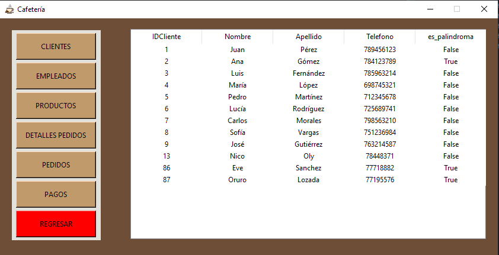

# DEFENSA DE: NICOLAS EMANUEL OLY SANCHEZ 

-----------------------------------------------------------------------------
## La defensa constaba de verificar si los nombres de la tabla "Clientes" eran palindromos o no
-----------------------------------------------------------------------------------------------
## La respuesta de la **Defensa** consta de 2 archivos
### -es_palindromo
### -update_tabla_clientes
-------------------
## es_palindromo

```
    def verificar_palindromos(nombres, index=0):
        if index == len(nombres):  
            return []
        
        nombre = nombres[index]
        
        es_palindromo = "True"  
        for i in range(len(nombre) // 2):  
            if nombre[i] != nombre[len(nombre)-1-i]:
                es_palindromo = "False" 
                break  
        
       
        return [es_palindromo] + verificar_palindromos(nombres, index + 1)
```

### El módulo **es_palindromo** consta de una funcion recursiva que recibe un lista de **nombres** y verifica nombre por nombre para ver si son palindromos o no, si son palindromo devuelven "True" y si no son palindromos devuelven "False". En esta funcion se usa la recursion para recorrer la lista de nombres, y para verificar si son o no palindromos se va comparando desde el principio del nombre, y desde el final del nombre.

----------------------------------------------------------------------
## update_tabla_clientes
``` 
from tkinter_app.funciones import *

conexion_base_de_datos=Funciones()

#funcion para obtener los nombres solo de la tabla clientes
def obtener_nombres(tabla):
        
        try:
            cursor = conexion_base_de_datos.conexion.cursor()
            if tabla=="clientes":
                consulta = f"SELECT Nombre FROM {tabla}"      
                cursor.execute(consulta)
                resultados = cursor.fetchall()
                return resultados
        except pyodbc.Error as e:
            return str(e) 


def insertar_valores_palindromo(ids,valores):
        try:
            cursor = conexion_base_de_datos.conexion.cursor()
            consulta = '''UPDATE clientes SET es_palindroma = ? WHERE IDCliente = ?'''
            for i in range(len(ids)):
                id_val = ids[i]
                valor = valores[i]
                cursor.execute(consulta, (valor, id_val))
            conexion_base_de_datos.conexion.commit()  
            return True
        except pyodbc.Error as e:
            return str(e)
        except ValueError as ve:
            return str(ve)
```
### El módulo **update_tabla_clientes** tiene la funcion de recoger los nombres de la tabla **"clientes"**. Primeramente se importa el modulo **funciones** de la carpeta **tkinter_app**, y se crea un objeto **Funciones()** para establecer la conexion con la base de datos, luego en la funcion **def obtener_nombres**, y luego en la funcion **def insertar_valores_palindromo** inserta la lista de valores "True" o "False" a la columna **es_palindromo** de la tabla **"clientes"**

# Demostración 

